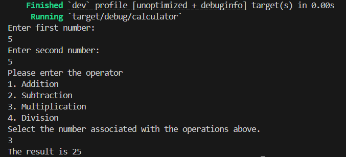

# Calculator Making Guide in Rust

In order to make an calculator we must have installed rust and have dived into its data types.

Let's start building:
Enter the command ```cargo new calculator```. This will create a directory with ```src\main.rs``` inside it.

```rs
Initial function:

fn main(){
    println!("Hello, World")!
}
```

For a calculator, we must require ```addition```, ```subtraction```, ```multiplication``` and ```division```.

First we must create two ```mut``` variable to perform the operation:

```rs
fn main(){
    let mut a = String::new();
    let mut b = String::new();
}
```

Now we have to read the input and parse the variable to ```f64``` float.
Lets write a function ```input_parser()``` such that it can be reused whenever necessary:

```rs
fn input_parser() -> f64{
    let mut x = String::new();

    // This is to take input from the user. For this we use std::io;
    io::stdin().
        read_line(&mut x).
        expect("Failed to read the line");
    

    // This will trim the String input and then parse to f64 float type.
    let x: f64 = match x.trim().parse(){
        Ok(num) => num,
        Err(_) => {
            println!("Invalid Input");
            return;
        }
    };

    // Returning our float x
    return x;
}
```

Now lets look at our main function:

```rs
use std::io;

fn main() {
    let result:f64;

    println!("Enter first number:");
    // This will read the user input as number a and parse to f64 float data type.
    let a: f64 = input_parser();
    //check for error
    if f64::is_nan(a){
        return;
    }

    println!("Enter second number:");
    // This will read the user input as number b and parse to f64 float data type.
    let b: f64 = input_parser();
    //check for error
    if f64::is_nan(b){
        return;
    }
}

fn input_parser() -> f64{
    let mut x = String::new();
    io::stdin().
        read_line(&mut x).
        expect("Failed to read the line");
    
    let x: f64 = match x.trim().parse(){
        Ok(num) => num,
        Err(_) => {
            println!("Invalid Input");
            return f64::NAN;
        }
    };

    return x;
}
```

Now we take user input for what operation to perform:
```rs
fun main(){
    let result:f64;

    // existing code
    println!("Please enter the operator");
    println!("1. Addition");
    println!("2. Subtraction");
    println!("3. Multiplication");
    println!("4. Division");
    println!("Select the number associated with the operations above.");

    let op: f64 = input_parser();

    if f64::is_nan(op){
        return;
    }

    let op:i32 = op as i32;

    match op {
        1 => result = a+b,
        2 => result = a-b,
        3 => result = a*b,
        4 => result = a/b,
        _ => {
            println!("Invalid operator selection");
            return;
        }
}
    println!("The result is {}", result);
}

fn input_parser() -> f64 {
    // existing code
}
```

Lets see how the final code looks like:
```rs
use std::io;

fn main() {
    let result:f64;

    println!("Enter first number:");

    let a: f64 = input_parser();

    if f64::is_nan(a){
        return;
    }

    println!("Enter second number:");
    let b: f64 = input_parser();

    if f64::is_nan(b){
        return;
    }

    println!("Please enter the operator");
    println!("1. Addition");
    println!("2. Subtraction");
    println!("3. Multiplication");
    println!("4. Division");
    println!("Select the number associated with the operations above.");

    let op: f64 = input_parser();

    if f64::is_nan(op){
        return;
    }

    let op:i32 = op as i32;

    match op {
        1 => result = a+b,
        2 => result = a-b,
        3 => result = a*b,
        4 => result = a/b,
        _ => {
            println!("Invalid operator selection");
            return;
        }
}
    println!("The result is {}", result);
}

fn input_parser() -> f64{
    let mut x = String::new();
    io::stdin().
        read_line(&mut x).
        expect("Failed to read the line");
    
    let x: f64 = match x.trim().parse(){
        Ok(num) => num,
        Err(_) => {
            println!("Invalid Input");
            return f64::NAN;
        }
    };

    return x;
}
```

Bingo, we successfully made a calculator to perform the above operations.

Now, let's test it:

```sh
cargo build
```

```sh
Cargo run
```

The output will look like:
```sh
cargo run
    Finished `dev` profile [unoptimized + debuginfo] target(s) in 0.00s
     Running `target/debug/calculator`
Enter first number:
5
Enter second number:
5
Please enter the operator
1. Addition
2. Subtraction
3. Multiplication
4. Division
Select the number associated with the operations above.
3
The result is 25


```
